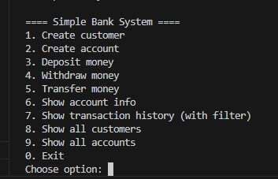
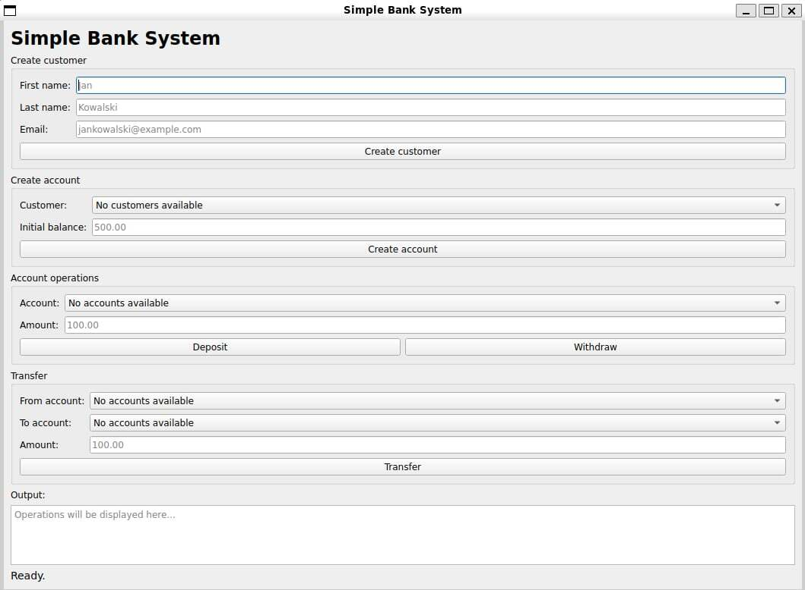
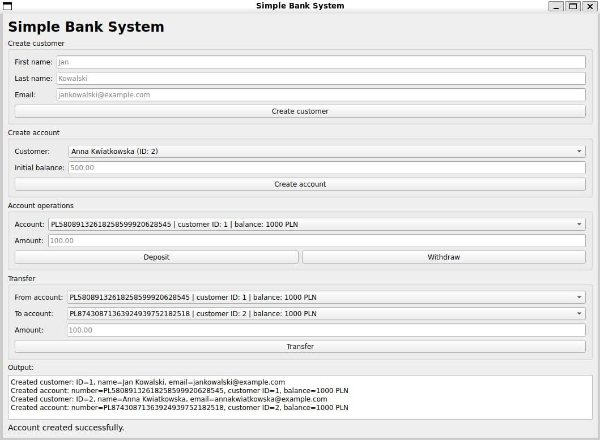
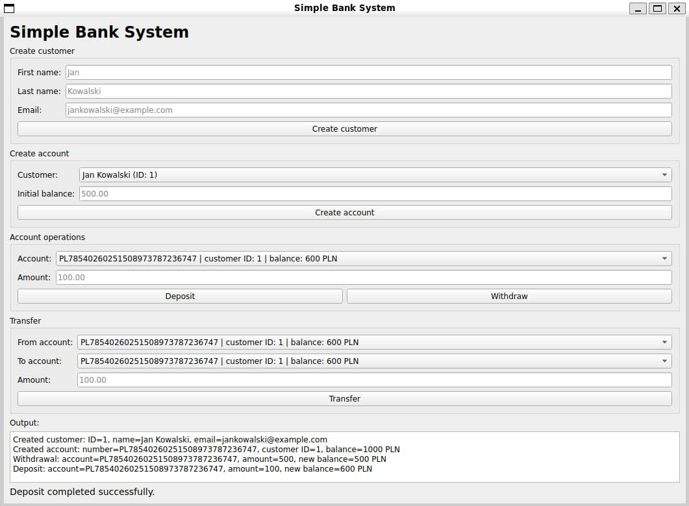

# Simple Bank System

Simple Bank System is a C++17 banking application built to practice object-oriented programming, clean project structure,
business logic separation and basic GUI development.

The project contains two interfaces that use the same banking logic:

- a **console interface** for terminal-based usage,
- a **Qt Widgets GUI prototype** for graphical interaction.

The main goal of the project is to keep the banking logic independent from the user inteface,
so the same service and repository layers can be reused by both the console application and the GUI version.

---

## Screenshots






## Features

### Customer management
- create customers,
- validate customer names,
- validate email format,
- prevent duplicated email addresses,
- display all customers.

### Account management
- create bank accounts for existing customers,
- generate Polish-style account numbers starting with `PL`,
- validate initial balance,
- display all accounts,
- display single account information.

### Banking operations
- deposit money,
- withdraw money,
- transfer money between accounts,
- reject invalid operations,
- prevent withdrawals and transfers when the source account has insufficient funds,
- prevent transfers to the same account.

### Transactions
- store transaction history in memory,
- support transaction types:
  - deposit,
  - withdrawal,
  - transfer in,
  - transfer out,
- store transaction timestamps,
- filter transactions by type.


### Tests
- service-level tests fot the main banking operations,
- tests for invalid operations,
- test for tranfser scenarios,
- tests for transaction history and filtering,
- CTest integration.

---
## Technologies
- C++17
- CMake
- CTest
- Qt Widgets
- STL
- `std::optional`
- Object-Oriented Programming
- Repository pattern
- Service layer


---

## Architecture

The application is divided into layers.

### Domain layer

The domain layer contains the core objects used by the system:

- `Customer`,
- `Account`,
- `Transaction`.

These classes represent the main business entities of the banking application.

### Repository layer

The repository layer stores and manages objects in memory.

Repositories are responsible for operations such as:

- adding customers,
- finding customers by ID or email,
- adding accounts,
- finding accounts by account number,
- updating account balances,
- storing transactions,
- filtering transactions by account number and type.

The project also contains repository interfaces, which makes the service layer less dependent on concrete repository implementations.

### Service layer

The `BankService` class contains the main business logic of the application.

It handles:

- customer creation,
- account creation,
- deposits,
- withdrawals,
- transfers,
- transaction creation,
- account and customer lookup,
- transaction filtering.

### UI layer

The project currently has two user interfaces.
---

## Console Interface

The console application provides the following menu:

```text
==== Simple Bank System ====
1. Create customer
2. Create account
3. Deposit money
4. Withdraw money
5. Transfer money
6. Show account info
7. Show transaction history (with filter)
8. Show all customers
9. Show all accounts
0. Exit
```

This version is useful for quickly testing the banking logic without using the graphical interface.

---

## Qt GUI Interface

The GUI prototype contains sections for:

- creating a customer,
- creating an account for a selected customer,
- depositing money,
- withdrawing money,
- transferring money between two selected accounts,
- displaying status messages and operation results.

The GUI updates account selection boxes after new accounts are created and after balances change.

---

## Validation and Business Rules

The application validates important user input and business rules, including:

- customer name cannot contain digits,
- duplicated email addresses are rejected,
- initial account balance cannot be negative,
- deposit amount must be positive,
- withdrawal amount must be positive,
- transfer amount must be positive,
- source and target account in transfer must be different,
- operations on missing accounts are rejected,
- withdrawal and transfer cannot exceed the source account balance.

---

## Build and Run

### Requirements

Make sure you have installed:

- C++17 compiler,
- CMake 3.16 or newer,
- Qt5 Widgets.

### Build

```bash
git clone <repository-url>
cd simple-bank-system
mkdir build
cd build
cmake ..
cmake --build .
```

### Run console version

```bash
./SimpleBankSystem
```

On Windows, the executable may be located in a configuration directory, for example:

```bash
./Debug/SimpleBankSystem.exe
```

### Run GUI version

```bash
./SimpleBankSystemGui
```

On Windows:

```bash
./Debug/SimpleBankSystemGui.exe
```

---

## Run Tests

After building the project, run:

```bash
ctest --output-on-failure
```

You can also run the test executable directly:

```bash
./BankServiceTests
```

---

## Example Use Case

1. Create a customer.
2. Create two accounts for the customer or for two different customers.
3. Deposit money into the first account.
4. Transfer part of the money to the second account.
5. Display account information.
6. Check transaction history using the selected transaction type filter.

---


---
## Future Improvements

Possible improvements:

- save customers, accounts and transactions to files,
- add a database,
- add transaction history view to the GUI,
- improve GUI layout and styling,
- add user login,
- add account deletion,
- add more unit tests,
- improve error handling,
- add CI workflow for automatic builds and tests.


